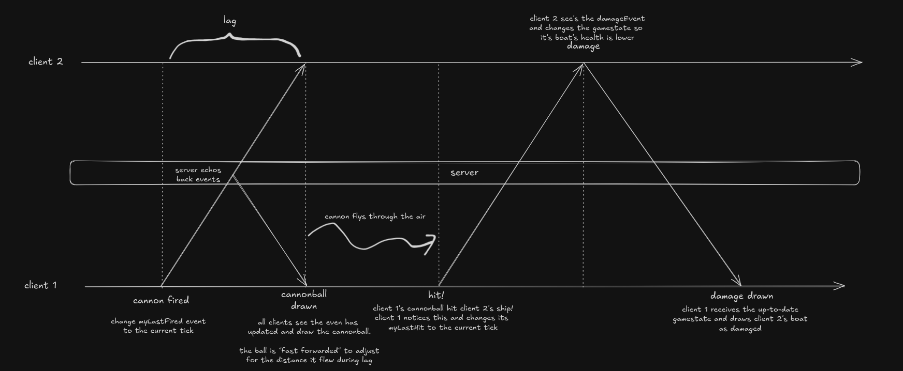

# boats
in this game players play as boat and try to shoot each other with cannons


## architecture


to avoid race conditions, all incoming packets are read by the 'player async'. which copies it's data every frame before updating the gamestate. 

https://excalidraw.com/#json=7yOYuo--LjJ1GtKxuTN67,tlHt3XSCNeAxYY0wnuBRng
the cannonballs are fast forwarded to account for lag 

## installation

install java 21
```powershell
winget install --id=Oracle.JDK.21 -e
```
check if git is installed
```powershell
git --version
```
if it is not installed, install it with:
```powershell
winget install --id Git.Git -e --source winget
```
you may need to close and reopen your terminal after installing in order to use git commands.
### clone the repository
```powershell
git clone https://github.com/PumpkinPie314/boats.git
cd boats
```
### configure the client
open `\client\client-config.txt` and change the server ip and port to match the server you want to join.
example:
```
serverip = pumpkin.playit.gg
serverport = 44230
saildown = GLFW_KEY_W
sailup = GLFW_KEY_S
wheelleft = GLFW_KEY_A
wheelright = GLFW_KEY_D
sailleft = GLFW_KEY_X
sailright = GLFW_KEY_C
firecannon = GLFW_KEY_SPACE
connectiontimout = 1000
```
or if you are running the server locally:
```
serverip = localhost
serverport = 52025
saildown = GLFW_KEY_W
sailup = GLFW_KEY_S
wheelleft = GLFW_KEY_A
wheelright = GLFW_KEY_D
sailleft = GLFW_KEY_X
sailright = GLFW_KEY_C
firecannon = GLFW_KEY_SPACE
connectiontimout = 1000
```
the options for keys can be found at https://www.glfw.org/docs/3.3/group__keys.html
### run the client
make sure your terminal is in the `boats` folder and run:
```powershell
./gradlew client:run
```
### running a server
to run a server locally, make sure your terminal is in the `boats` folder and run:
```powershell
./gradlew server:run
```
to change the server setting, they are in `server/config.txt`. when this file is changed, the server will automatically reload the settings. and send them to the clients.


# a quick git guide
to pull the latest changes from the repository:
```powershell
git pull
```
if you made changes it will not let you pull until you commit or stash your changes.
to commit your changes:
```powershell
git stash
git pull
git stash pop
```
this will save your changes, pull the latest changes from the repository, and then apply your changes

if you dont want to save your changes, you can just run:
```powershell
git reset --hard
git pull
```